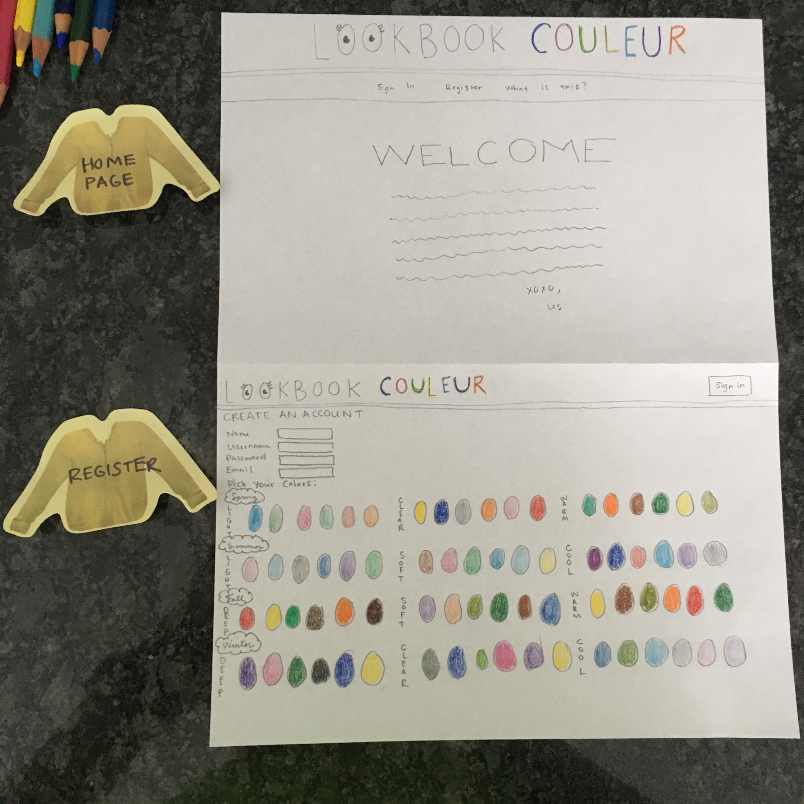
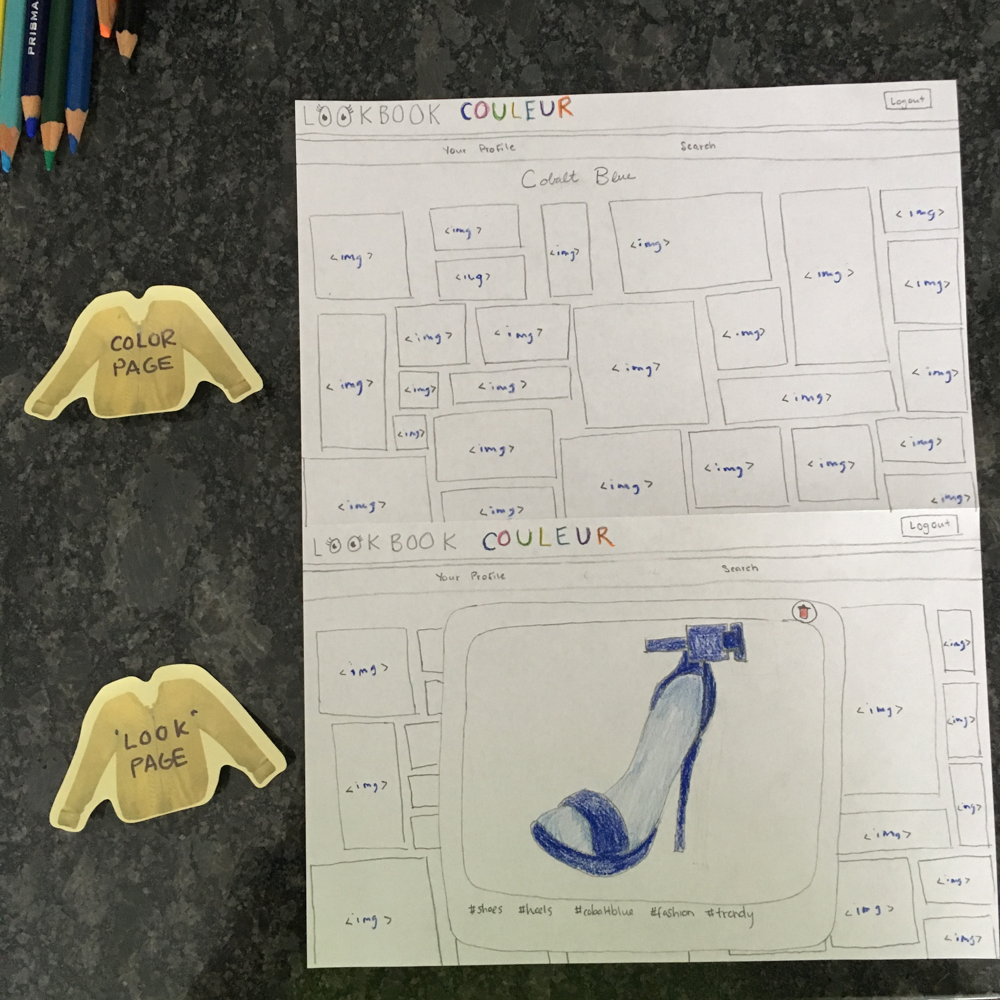
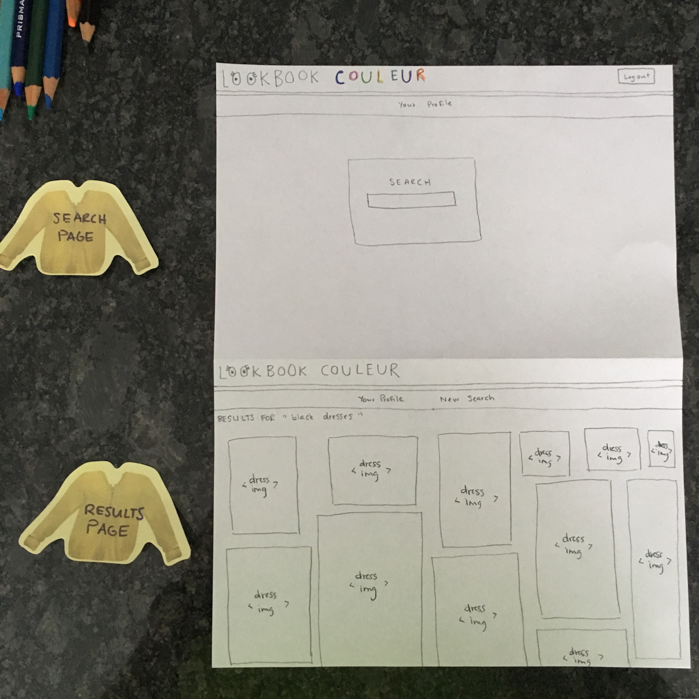

## LookBook Couleur
##### What is this?

 This is a fullstack application where a user is able to create an account and choose a collection of six colors.
The user is able to paste url's from other websites into a field and all the images will be extracted form that website and saved into the users profile page.

##### Why?

The primary goal of this application is to allow the user to store images of their liking in accessible place. It is primarily meant for storing images related to inspiring fashion ideas to the user.

##### What technologies were used?
React, Sinatra, Ruby, JavaScript, Css, Postgresql, various ruby modules like sinatra-activerecord, 
sinatra-cross-origin, and bycrpt (for password security), and various JavaScript node modules like cheerio, request, and superagent.

##### Strech Goals
- create a quiz to determine the users best color match based on users physical attributes.
- create a search assist functionality to search for clothing items in the users selected colors.
- have a recommended list of images based on the users saved images.
- have a share lookbook feature where the user can create a folder of saved images and share it with other users on the site.
- have a rating system for lookbooks, and a browse top rated lookbooks feature.

##### Wireframes

